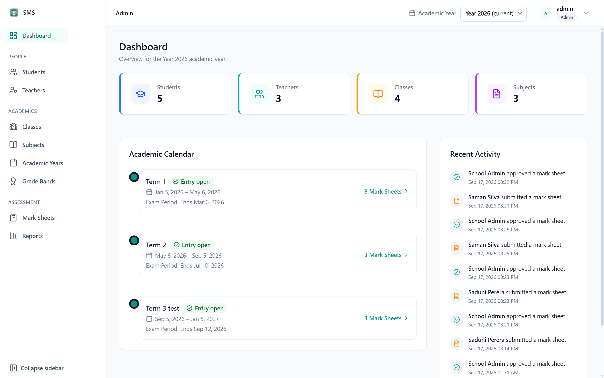
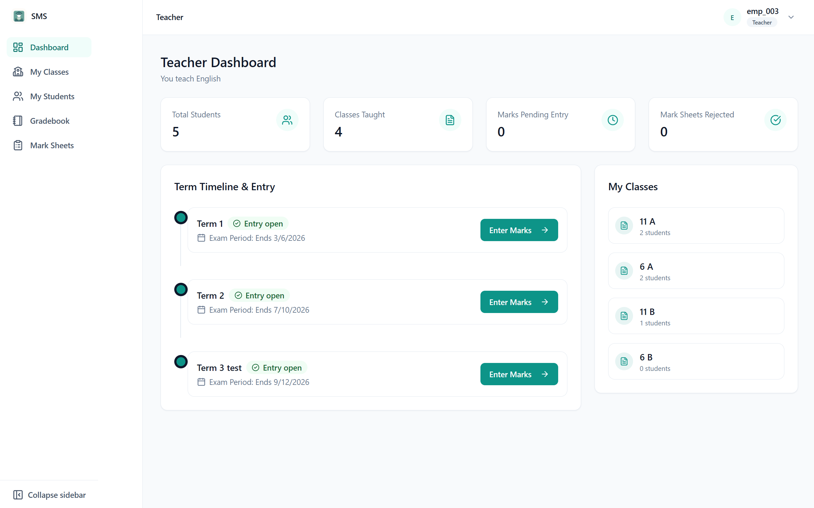
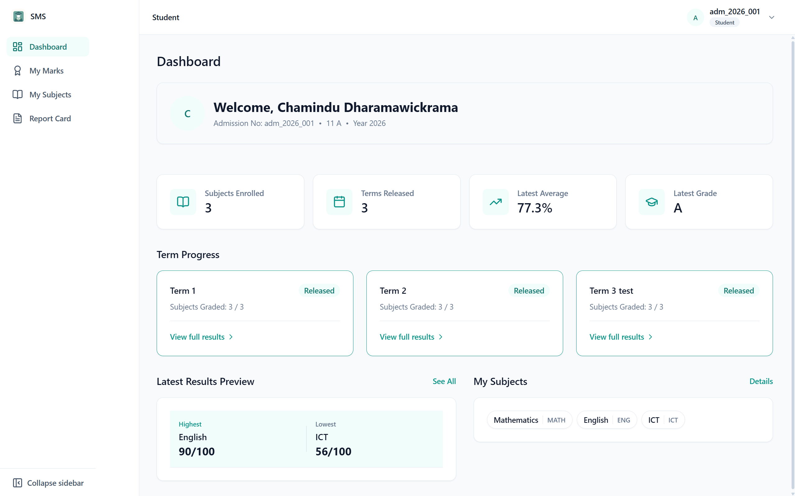
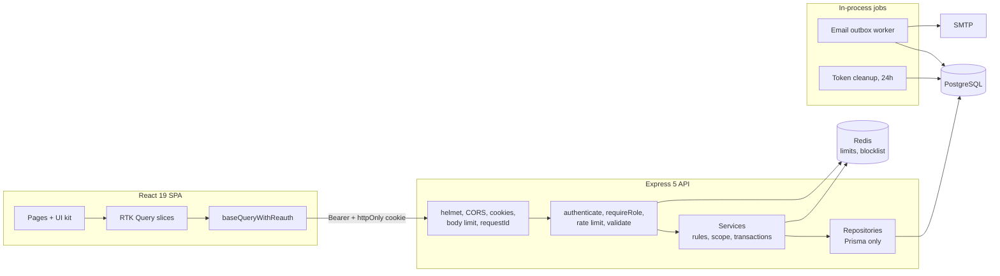
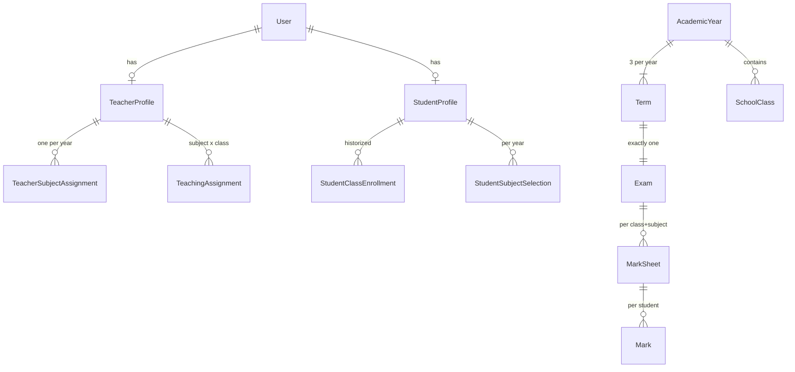

# Student Management System

> Role-based school management platform where administrators configure the academic year and users, teachers enter marks only within server-derived teaching scope, and students see results only after formal approval..

**Express 5 · Prisma 7 · PostgreSQL · Redis** API + **React 19 · TypeScript · RTK Query** SPA, in one monorepo.

[Overview](#overview) · [Dashboards](#dashboards) · [Features](#key-features) · [Architecture](#architecture) · [Highlights](#technical-highlights) · [Getting started](#getting-started) · [API](#api-surface) · [Security](#security) · [Trade-offs](#engineering-decisions-and-trade-offs) · [Status & limitations](#project-status-and-limitations)

---

## Overview

One school runs **academic years**, each with **three terms**, each term with **exactly one exam**. Three roles:

| Role | Can do |
|---|---|
| `SCHOOL_ADMIN` | Manage years, classes, subjects, grade bands; register students and teachers; set exam periods; generate, approve, reject and lock mark sheets; export reports. |
| `TEACHER` | See only their own subject and assigned classes; enter marks in a gradebook; submit mark sheets for approval. |
| `STUDENT` | Read-only: own subjects, released marks per term, term report card. |

There is **no public registration** — an admin provisions every account, and a one-time password is emailed (never returned by the API). The core rule: **a teacher's authority is never taken from the request**; it is re-derived from the database on every call.

### Why it's built this way

- **Server-derived identity.** `POST /api/teacher/marks` accepts only `studentId`, `examId`, `marksObtained`, `isAbsent`, `remarks`. Subject and class are derived server-side and checked against the teacher's teaching assignments — no request field can widen scope.
- **Approval before visibility.** A mark reaches the student only after its sheet moves `DRAFT → SUBMITTED → APPROVED` (or `LOCKED`).
- **History is never destroyed.** Enrollments, subject selections and teaching assignments are historized; deletes are soft wherever history exists.
- **Grades are snapshots.** The letter grade is resolved at save time and stored, so later grade-band edits never rewrite issued report cards.

---

## Dashboards

Each role has its own dashboard endpoint (`GET /api/dashboard/admin | teacher | student`) that aggregates only what that role may see.



**Administrator** — school-wide counts; an academic calendar showing each term's dates, exam-period end, an *Entry open* badge computed from `exam.endDate`, and its mark sheets; a recent-activity feed from the audit log. The top-bar academic-year switcher is global to every admin screen.

<table>
  <tr>
    <td width="50%"></td>
    <td width="50%"></td>
  </tr>
  <tr>
    <td valign="top"><b>Teacher</b> — scoped by <code>resolveTeacherScope</code>: their one subject, students and classes in scope, marks pending entry, rejected sheets, a term timeline with each entry gate and an <i>Enter Marks</i> link, and only their own classes.</td>
    <td valign="top"><b>Student</b> — subjects, terms released, latest average and grade. A term shows <i>Released</i> only when <b>every</b> selected subject's sheet is approved or locked; plus highest/lowest result and subject list.</td>
  </tr>
</table>

---

## Key features

**Academic configuration**
- Creating a year **auto-provisions 3 terms + 3 exams** in one transaction (no term/exam create or delete endpoints). One `isCurrent` year, switched atomically.
- Exam periods must fall inside their term; grade bands reject overlapping ranges; class grade levels validate against `SchoolConfig` (default 6–13).

**People management**
- Student/teacher registration — account, username, one-time password and credential email — commits in **one transaction**.
- Per-year subject selections are replaced via a diff-sync that toggles rows, never deletes them.
- A teacher has **exactly one subject per year** (DB-enforced), teaching-assignment classes, and optionally one class-teacher role.
- Relationship-aware delete: referenced records are soft-deactivated, unreferenced ones hard-deleted. Deactivating a class ends its teaching assignments and clears its class teacher, revoking mark-entry scope.

**Marks and approval**
- **Entry unlocks by date** — once `exam.endDate` passes; before that (or if unset) the API returns `409`. No manual open/close toggle.
- **Idempotent mark sheet generation** per `(class, subject)` that a student actually selected; groups with no teaching assignment are reported as `unresolved`, never auto-assigned.
- **All-or-nothing bulk entry**, validated fully before any write, across multiple classes in one transaction.
- **State machine** `DRAFT → SUBMITTED → APPROVED | REJECTED → LOCKED` (`REJECTED → SUBMITTED` to resubmit). Submission blocked while any student lacks a mark or absent flag; every transition is audit-logged.

**Portals, reports and accounts**
- Teacher gradebook grid with client-side grade preview, dirty-row tracking and bulk save; student marks per term and report card.
- Student term report and class exam report (highest, lowest, average, pass rate, grade distribution) as `json | pdf | excel` via `pdfkit` / `exceljs`, streamed from memory. Students see only released rows.
- Username login, JWT access + rotating refresh token, **unskippable first-login password change**, forgot/reset password, logout-all.
- Transactional **email outbox** with background delivery, exponential backoff, jitter and stuck-job recovery.

---

## How a mark is entered

```text
Teacher → { studentId, examId, marksObtained | isAbsent, remarks }
   ↓  resolveTeacherScope(userId)            subject + classes, from the DB only
   ↓  exam in current year?          400     exam period ended?        409
   ↓  student enrolled in a class?   400/404 class in write scope?     403
   ↓  resolve grade from bands (snapshot)
   ↓  transaction: upsert DRAFT MarkSheet → assert editable → create Mark
Teacher submits → admin approves → student can see it
```

**Session:** login returns an in-memory access token (15 min) and an httpOnly refresh cookie (7 days). Any `401` triggers one shared `/auth/refresh`, then a retry; if refresh fails, every client cache is wiped and the user is logged out.

---

## Architecture

A **modular monolith**: each feature module is layered `routes → validator → controller → service → repository → dto`.



| Component | Role |
|---|---|
| `middlewares/authenticate.js` | JWT verify, Redis blocklist check, per-user `iat` invalidation; `requireRole`, `requirePasswordAlreadyChanged`. |
| `middlewares/validate.js` | One Zod schema over `{ body, query, params }`; replaces them with parsed output; `422` with field details. |
| `middlewares/rateLimiter.js` | Atomic fixed-window Redis Lua script; `X-RateLimit-*` and `Retry-After` headers. |
| `*.service.js` / `*.repository.js` | Services own rules and transaction boundaries; repositories are Prisma-only with `*Tx` variants. |
| `teacher.scope.js`, `student.scope.js` | The authorization primitives: user id → reachable ids. |
| `markSheet.status.js` | Single source of truth for workflow transitions, editability and student visibility. |

### Domain model



Business rules enforced by the database, not just code:

| Unique constraint | Enforces |
|---|---|
| `Exam [termId]` | One exam per term |
| `TeacherSubjectAssignment [teacherId, academicYearId]` | One subject per teacher per year |
| `Class [academicYearId, classTeacherId]` | One class-teacher role per teacher per year (`NULL`s stay distinct) |
| `MarkSheet [subjectId, classId, examId]` | One sheet per subject × class × exam — makes generation idempotent |
| `Mark [markSheetId, studentId]` | One mark per student per sheet |
| `StudentSubjectSelection [studentId, subjectId, academicYearId]` | Toggled via `isActive`, never duplicated |

---

## Technology stack

| Layer | Technologies |
|---|---|
| Frontend | React 19, TypeScript 6, Vite 8, React Router 7, Redux Toolkit 2 + RTK Query |
| UI | Tailwind CSS v4 (CSS-first `@theme` tokens), lucide-react, react-hot-toast — no component, table, chart or date library |
| Forms | React Hook Form + Zod (Zod on the server too) |
| Backend | Node.js, Express 5, Prisma 7 with `@prisma/adapter-pg`, PostgreSQL |
| Redis | ioredis — rate limits, access-token blocklist, session invalidation |
| Auth | jsonwebtoken, bcrypt (cost 12), httpOnly refresh cookie |
| Email / exports | Nodemailer behind a DB outbox (console provider in dev); pdfkit, exceljs |
| Ops | Winston (JSON in prod), `X-Request-Id`, Helmet, CORS allowlist, compression, 10 KB body limit |

---

## Technical highlights

- **Server-derived scope.** `resolveTeacherScope` returns the teacher's subject, `teachingClassIds` (**write** scope) and `classTeacherClassId` (extra **read** scope). Filters are `AND`-ed onto scope, so an unauthorized `classId` yields an empty list rather than a `403` confirming the class exists. Edit rights are re-checked against the teacher's *current* scope, not the original author.
- **Refresh-token rotation with reuse detection.** Each login starts a token *family*; each refresh rotates and revokes the old token; replaying a revoked token revokes the whole family. Stored as SHA-256 hashes. Access tokens add two Redis revocation paths: a per-token blocklist (logout) and a per-user `iat` cutoff (logout-all, password change). The client de-duplicates concurrent refreshes into a single request.
- **Cache-reset registry.** School machines are shared. All 12 feature RTK Query slices (plus the academic-year slice) register a wipe callback with `registerCacheReset`; logout and failed refresh run them all — so one user's data never survives into the next login. The registry also breaks a circular import.
- **Idempotent reconciliation.** `reconcileExamMarkSheets` resolves each student's class for that year from enrollment history, uses subject selections as the only eligibility source, groups by `(class, subject)`, assigns owners only from `TeachingAssignment` (reporting the rest as `unresolved`), and inserts only what's missing via `createMany` + `skipDuplicates`.
- **Atomic bulk entry.** Two validation passes (scope, then one batched subject-selection query), aggregated `failures[]` with severity-ranked status (`404 → 403 → 409`), grade bands loaded once per batch.
- **Transactional outbox.** The credential email row is written in the *same transaction* as the account, so neither exists without the other. The worker retries with exponential backoff + jitter (max 30 min, 5 attempts) and recovers stuck jobs.
- **Operational lifecycle.** Boot-time DB retry (10 × 5 s), graceful `SIGTERM`/`SIGINT` shutdown with a forced-exit timer, tuned keep-alive timeouts, and an authenticated `/health` returning `503` when DB or Redis is down.
- **Frontend.** Feature-sliced folders, one lazy-loaded chunk per page, URL params as the source of truth for filters and pagination, and a hand-built 38-component UI kit.

---

## Project structure

```text
backend/
├── prisma/            schema.prisma · hand-written SQL migrations · seed.js (first admin)
├── postman/           importable API collection
└── src/
    ├── config/ jobs/ middlewares/ utils/ routes/
    └── modules/<feature>/     routes → validator → controller → service → repository → dto
        auth · profile · academicYear · class · subject · exam · gradeBand
        student · teacher · studentPortal · teacherPortal
        marks · markSheet · dashboard · report · email
frontend/src/
├── services/          baseQuery (reauth + cache registry) · tokenService (in-memory)
├── shared/            ui/ (38 components) · layout/ · guards/ · hooks/ · utils/
├── features/<feature>/  api · components · pages · types · validation
├── index.css          Tailwind v4 design tokens
└── App.tsx            lazy, role-scoped route tree
screenshot/            README images
```

---

## Getting started

**Prerequisites:** Node.js 20.6+ (scripts use `node --import tsx/esm`), PostgreSQL 14+, Redis 6+, and optionally SMTP (the console provider logs emails in development).

```bash
git clone https://github.com/Chamindu-Dharmawickrama/student_management_system.git && cd student_management_system
cd backend && npm install && cd ../frontend && npm install
```

**`backend/.env`** 

```env
NODE_ENV=development
PORT=8000
DATABASE_URL=your_postgresql_connection_string
REDIS_URL=your_redis_connection_string
ALLOWED_ORIGINS=http://localhost:5173

ACCESS_TOKEN_SECRET=your_access_token_secret
REFRESH_TOKEN_SECRET=your_refresh_token_secret
ACCESS_TOKEN_EXPIRY=15m
REFRESH_TOKEN_EXPIRY=7d
REFRESH_TOKEN_EXPIRY_MS=604800000
MAX_LOGIN_ATTEMPTS=3
LOCKOUT_DURATION_MS=900000
PASSWORD_RESET_EXPIRY_MS=900000

EMAIL_PROVIDER=console
EMAIL_FROM_ADDRESS=noreply@example.com
EMAIL_FROM_NAME=Your School Name
SMTP_HOST=your_smtp_host
SMTP_PORT=587
SMTP_SECURE=false
SMTP_USER=your_smtp_user
SMTP_PASS=your_smtp_password

# prisma/seed.js — first administrator
SEED_ADMIN_USERNAME=your_admin_username
SEED_ADMIN_EMAIL=your_admin_email
SEED_ADMIN_PASSWORD=your_admin_password
SEED_ADMIN_FIRST_NAME=Admin
SEED_ADMIN_LAST_NAME=User
```

In production, `DATABASE_URL`, `ALLOWED_ORIGINS` and `REDIS_URL` are required or the process refuses to start. **`frontend/.env`:** `VITE_API_BASE_URL=http://localhost:8000`.

```bash
# database (from backend/)
npx prisma migrate deploy     # apply the hand-written migrations
npx prisma generate           # client → src/generated/prisma
npx prisma db seed            # first SCHOOL_ADMIN; idempotent

# run
cd backend  && npm run dev    # http://localhost:8000   (npm start: without nodemon)
cd frontend && npm run dev    # http://localhost:5173   (also: build, lint, preview)
```

### Typical workflow

1. Log in as the seeded admin and set a new password (forced on first login).
2. Create a current academic year → terms and exams appear automatically.
3. Add subjects, classes and non-overlapping grade bands.
4. Register teachers (one subject + their classes) and students (class, year, subjects). With `EMAIL_PROVIDER=console`, credentials are logged instead of emailed.
5. Set each exam's date range, then generate mark sheets (safe to re-run after roster changes).
6. After the exam period ends, teachers enter marks and submit; admins approve, reject or lock.
7. Export reports as PDF (Excel via the API).

---

## API surface

67 routes under `/api` plus an authenticated `/health`. Full collection: [`backend/postman/Student-Management-System.postman_collection.json`](backend/postman/Student-Management-System.postman_collection.json).

| Base path | Access | Scope |
|---|---|---|
| `/auth` | public / bearer | login, refresh, logout, logout-all, forgot / reset / change password |
| `/profile` | any role | own account (`PATCH`/`DELETE` exist but are deliberately not in the UI) |
| `/students`, `/teachers` | admin | CRUD, deactivate, subject selections / assignments |
| `/subjects`, `/classes`, `/academic-years`, `/exams` | admin | configuration, exam periods, mark sheet generation |
| `/grade-bands` | read: any · write: admin | grading scale |
| `/marksheets` | scoped | list/detail, submit (teacher), approve / reject / lock (admin) |
| `/teacher`, `/student` | own role | self-scoped portals, no id-in-path for students |
| `/dashboard`, `/reports` | per role | dashboards; term and class reports as `json\|pdf\|excel` |

```http
POST /api/teacher/marks
Authorization: Bearer <access-token>

{ "studentId": "<user-id>", "examId": "<exam-id>", "marksObtained": 78, "remarks": "Good improvement" }
```

No `teacherId`, `subjectId` or `classId` — the server derives them. Responses use `{ success, message, data, requestId, meta? }`; errors use `{ success: false, message, details?, requestId }`. Key statuses: `401` token invalid/revoked · `403` role, relationship or password-change gate · `409` business-rule conflict · `422` validation with field details · `429` rate limit or lockout. Production errors never expose stacks or Prisma messages, so clients branch on status, not text.

---

## Security

- **Passwords:** bcrypt cost 12; dummy-hash comparison for unknown users (no timing leak); one generic login error; lockout after 3 failures for 15 min (`429`); policy of 8–128 chars with upper, lower, digit and special, mirrored client-side; temporary passwords from `crypto.randomInt` and never returned by the API.
- **Tokens:** refresh tokens hashed, rotated, family-revoked on reuse; cookie `httpOnly`, `secure` + `sameSite=strict` + `__Secure-` prefix in production, scoped to `/api/auth`; `/auth/refresh` also requires `X-Requested-With` (CSRF). Access token kept **in memory only** — nothing in web storage.
- **Authorization:** `requireRole` on every protected route; `requirePasswordAlreadyChanged` everywhere except change-password; scope resolvers are the only source of reachable ids; students have no id-addressable route.
- **Input/output:** Zod on every payload; 10 KB body cap; Helmet; CORS allowlist; no `dangerouslySetInnerHTML`; redirects pass `sanitizeRedirectPath`.
- **Abuse & audit:** per-route Redis rate limits (IP, user id or email keyed); forgot-password never reveals whether an email exists; request ids on every log and response; workflow transitions written to `AuditLog`.

---

## Engineering decisions and trade-offs

| Decision | Benefit | Cost |
|---|---|---|
| Entry gated by exam date, `ExamStatus` enum removed | No forgotten manual toggle | Reopening early means editing dates |
| Grade snapshotted on save | Issued report cards never change | Corrected scales need a backfill |
| Stateless JWT + Redis blocklist + `iat` cutoff | Immediate revocation without a DB lookup | Revocation depends on Redis |
| Every mounted rate limiter set to fail **closed** (factory default is open) | Redis outage can't disable brute-force protection | Auth/export availability drops with Redis |
| Service-owned transactions over `*Tx` repositories | "Account + credential email" commits atomically in one place | More files per feature |
| Generated Prisma TS client run from JS via `tsx` | Plain-JS backend on Prisma 7's generator | Runtime transpile in the start path |
| Reconciliation instead of one-shot generation | Safe re-runs after roster changes | Never removes stale sheets |
| Hand-built UI kit | Full control of a11y and tokens | More code to maintain |

---

## Project status and limitations

**Not deployed**, and there is **no automated test suite, CI, Dockerfile or deployment config**. The backend `npm test` is a placeholder. Verification so far is manual against a local backend, plus the Postman collection. `npm run build` (type-check included) passes.

The code is partly ready for deployment: required-env checks in production, `trust proxy`, graceful shutdown, `/health`, boot retry, JSON logs, `migrate deploy`, and an idempotent seed. Still missing: containers or a platform target, managed Postgres/Redis, real SMTP, secret management, TLS.

Known gaps:

- `npm run lint` **fails** in `frontend/` (17 errors, 4 warnings): 14 `no-explicit-any` violations plus React Hooks rule errors in `GradebookGrid`, `StudentFormPage`, `TeacherFormPage`, `ClassResultsTab`, `SubjectSelectionManager`, `StudentMarksPage`, `TeacherMarksheetsPage`, `TeacherStudentsPage`. The planned security/a11y/performance hardening pass hasn't been done yet.
- **Excel export is API-only**; the UI offers PDF.
- **Google sign-in isn't implemented.** `authProvider` exists and `google-auth-library` is installed but unused.
- **`SchoolConfig` has no endpoint**, so the defaults apply. **`AuditLog`** is only surfaced as the dashboard activity feed. **`Report.filePath`** is always null because exports aren't persisted.
- **Jobs are in-process** (`setInterval`): multiple replicas would each run a worker. **Report rendering is synchronous** in the request path (10/min/user).
- **No file upload** behind `photoUrl` / `logoUrl`. **Single-school**, no tenancy.
- Leftover naming from an earlier project: package name `auth-system-backend`, default `EMAIL_FROM_NAME` `NoteVault`.

**Next steps (implied by the gaps above):** fix lint and enforce it as a gate; add tests for the scope resolvers, the state machine, grade-band overlap and reconciliation, plus integration tests on the authorization boundaries; add CI, containers and deployment.

**Possible extensions (not committed work):** a `SchoolConfig` screen and an audit browser; Excel download in the UI and persisted reports; an out-of-process worker or queue; photo and logo upload; attendance, timetabling and guardian accounts.

---

## Documentation & license

- [`frontend/README.md`](frontend/README.md) — frontend stack and scripts
- [`backend/prisma/schema.prisma`](backend/prisma/schema.prisma) — data model, with constraints explained inline
- [`backend/postman/`](backend/postman/) — API collection

**License:** [MIT](LICENSE)

